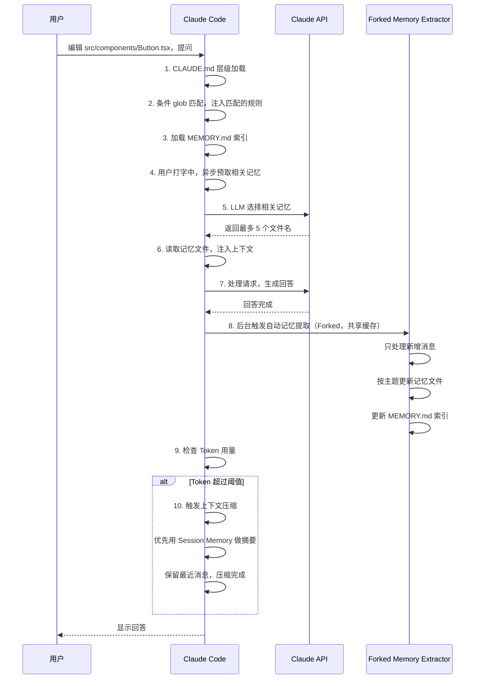

# Claude Code 源代码深度剖析：记忆系统与上下文工程的设计哲学

> 基于恢复的 Claude Code 源代码，结合关键代码片段，深入剖析其架构设计、实现细节和工程思想。

## 目录

- [前言：为什么 Claude Code 值得深入分析](#前言为什么-claude-code-值得深入分析)
- [一、问题背景：LLM 编程助手的三大痛点](#一问题背景llm-编程助手的三大痛点)
- [二、上下文工程：CLAUDE.md 层级系统深度剖析](#二上下文工程claudemd-层级系统深度剖析)
  - [上下文窗口加载顺序](#上下文窗口加载顺序)
  - [2.1 核心问题：为什么需要上下文工程？](#21-核心问题为什么需要上下文工程)
  - [2.2 层级优先级设计](#22-层级优先级设计)
  - [2.3 条件规则：glob 匹配实现](#23-条件规则glob-匹配实现)
  - [2.4 @include 指令：精细化模块化](#24-include-指令精细化模块化)
  - [2.5 HTML 注释剥离：魔鬼在细节](#25-html-注释剥离魔鬼在细节)
  - [2.6 缓存与去重：性能优化](#26-缓存与去重性能优化)
  - [2.7 上下文工程设计总结](#27-上下文工程设计总结)
- [三、记忆系统：Memdir 自动记忆体系](#三记忆系统memdir-自动记忆体系)
  - [3.1 核心问题：为什么需要自动记忆？](#31-核心问题为什么需要自动记忆)
  - [3.2 记忆分类设计](#32-记忆分类设计)
  - [3.3 存储结构](#33-存储结构)
  - [3.4 自动记忆提取：增量处理与重叠合并](#34-自动记忆提取增量处理与重叠合并)
  - [3.5 权限白名单：安全设计](#35-权限白名单安全设计)
  - [3.6 动态相关检索：LLM 选择 vs 向量检索](#36-动态相关检索llm-选择-vs-向量检索)
  - [3.7 会话记忆：增量结构化摘要](#37-会话记忆增量结构化摘要)
- [四、Forked Agent：缓存共享的奇迹](#四forked-agent缓存共享的奇迹)
  - [4.1 为什么需要 Forked Agent？](#41-为什么需要-forked-agent)
  - [4.2 缓存键匹配原理](#42-缓存键匹配原理)
  - [4.3 状态隔离](#43-状态隔离)
  - [4.4 成本对比：50 倍节省](#44-成本对比50-倍节省)
- [五、上下文压缩：Token 预算管理](#五上下文压缩token-预算管理)
  - [5.1 触发阈值计算](#51-触发阈值计算)
  - [5.2 优先策略：会话记忆压缩](#52-优先策略会话记忆压缩)
  - [5.3 回退策略：全量压缩](#53-回退策略全量压缩)
  - [5.4 断路器保护](#54-断路器保护)
  - [5.5 不变性保证](#55-不变性保证)
- [六、上下文工程与记忆系统如何协同](#六上下文工程与记忆系统如何协同)
  - [6.1 分层职责对比](#61-分层职责对比)
  - [6.2 完整请求处理流程](#62-完整请求处理流程)
  - [6.3 时序图](#63-时序图)
- [七、设计哲学总结](#七设计哲学总结)
  - [7.1 不追求银弹，组合解决问题](#71-不追求银弹组合解决问题)
  - [7.2 成本意识贯穿始终](#72-成本意识贯穿始终)
  - [7.3 安全优先：最小权限](#73-安全优先最小权限)
  - [7.4 细节打磨：用户体验在细节](#74-细节打磨用户体验在细节)
  - [7.5 容错设计：系统稳定性](#75-容错设计系统稳定性)
- [附录：关键文件位置](#附录关键文件位置)

---

## 前言：为什么 Claude Code 值得深入分析

Claude Code 不是一个简单的 VS Code 插件，它是 Anthropic 对「**如何让 LLM 长期稳定地在大型项目中工作**」这个问题给出的完整答案。

当我们谈论「AI 编程助手」时，很多人关注的是「能不能写代码」、「能不能修 bug」。但 Claude Code 的设计者思考得更深：**人天级、多会话的编程过程中，AI 如何记住项目信息、用户习惯、之前踩过的坑，同时不超出上下文窗口限制？**

这篇分析从源代码出发，深入拆解 Claude Code 给出的答案。

---

## 一、问题背景：LLM 编程助手的三大痛点

Claude Code 是一个智能代理编程工具，核心运行循环是：**收集上下文 → 采取行动 → 验证结果**，不断重复直到任务完成。你可以随时中断并调整方向，Claude 保持响应。

这个循环依赖于**上下文窗口**承载所有信息——系统提示、项目规则、记忆、代码、对话都在这里。但上下文窗口是有限的，所以高效的上下文管理是整个系统的核心挑战。

LLM 做编程助手，天然面临三个难以解决的问题：

| 痛点 | 描述 |
|------|------|
| **1. 上下文窗口限制** | 不管 200k 还是 1M token，多轮对话后总会满 |
| **2. 长期记忆丢失** | 跨会话、隔几天回来，AI 就忘了之前的设计决策 |
| **3. 知识不一致** | 不同目录不同文件需要不同规则，全放进去污染上下文 |

Claude Code 的解法不是「换更大的窗口」，也不是「全靠 RAG」，而是通过**分层架构**组合多种机制：

- **上下文工程（CLAUDE.md）** → 解决「知识不一致」问题
- **分层记忆系统（Memdir + Session Memory）** → 解决「长期记忆丢失」问题
- **动态相关检索** → 解决「长尾知识唤醒」问题
- **上下文压缩** → 解决「上下文窗口限制」问题
- **Forked Agent 缓存共享** → 让所有后台处理成本可接受

【**举例**】
想象你在一个大型电商项目中开发：
- 前端用 React + TypeScript，要求双引号、缩进 2 空格
- 后端用 Python Flask，要求单引号、缩进 4 空格
- 你个人偏好注释要详细，但团队要求精简注释

如果不做分层处理，把所有规则都给 AI，AI 写 Python 时可能还用 TypeScript 的缩进规则，或者搞混引号风格。而且 3 种规则加起来上百行，占掉很多宝贵的 token。Claude Code 的分层设计正好解决这个问题：你在哪个目录改什么类型的文件，就只给你对应的规则。

---

## 二、上下文工程：CLAUDE.md 层级系统深度剖析

### 上下文窗口加载顺序

根据官方文档，一个新会话启动时，context window 按照以下顺序填充：

| 加载内容 | 典型 Token 消耗 | 说明 |
|----------|----------------|------|
| System prompt | ~4,200 | 核心行为、工具使用、响应格式指令，总是第一个加载 |
| Auto memory (MEMORY.md) | ~680 | 自动记忆索引，前 200 行 / 25KB 加载 |
| Environment info | ~280 | 工作目录、平台、shell、git 分支信息 |
| MCP tools (deferred) | ~120 | 只列出工具名，full schema 按需加载 |
| Skill descriptions | ~450 | 可用技能的一行描述，不占用空间直到实际调用 |
| `~/.claude/CLAUDE.md` | ~320 | 用户全局偏好 |
| Project `CLAUDE.md` | ~1,800 | 项目规范、构建命令、架构笔记 |
| 用户提问 | ~45 | 你的问题 |
| ...然后文件读取和规则按需加载... | - | 读文件时自动匹配加载 path-scoped rules |

官方特别提示：**文件读取占据了大部分上下文使用**。提示越具体（比如"fix the bug in auth.ts"），Claude 需要读的文件越少。

### 2.1 核心问题：为什么需要上下文工程？

在一个大型项目中：
- 根目录有整体项目的编码规范
- `src/backend` 需要符合后端规范
- `src/frontend` 需要符合前端规范
- `*.ts` 需要 TypeScript 规则
- `*.py` 需要 Python 规则

如果把所有规则都一次性给模型，会：
1. 占掉大量 token，浪费上下文空间
2. 规则冲突，模型不知道该用哪个
3. 无关规则干扰模型判断

Claude Code 的解决方案：**层级化 + 条件匹配 + 就近优先级**。

【**举例**】
假设你在开发一个全栈项目：
- 公司统一规定：所有代码必须添加版权声明头（全局规则）
- 前端团队规定：React 组件必须用 TypeScript 泛型（前端规则）
- 后端团队规定：Python 函数必须写文档字符串（后端规则）
- 你个人习惯：调试代码保留 `console.log()` 不删除（个人规则）

如果没有层级设计：
- 所有规则堆在一起，几千 token 没了
- AI 可能搞混前端后端的规则，写 Python 还用 TypeScript 语法
- 你的个人习惯会影响团队其他成员

Claude Code 的方案：全局规则最低优先级，项目规则覆盖全局，你的个人规则覆盖项目，就近生效。改后端代码时，只有公司全局规则 + 后端规则 + 个人规则生效，前端规则根本不会进来，既省 token 又不会冲突。

### 2.2 层级优先级设计

```typescript
/**
 * Files are loaded in the following order:
 *
 * 1. Managed memory (eg. /etc/claude-code/CLAUDE.md) - Global instructions for all users
 * 2. User memory (~/.claude/CLAUDE.md) - Private global instructions for all projects
 * 3. Project memory (CLAUDE.md, .claude/CLAUDE.md, and .claude/rules/*.md in project roots) - Instructions checked into the codebase
 * 4. Local memory (CLAUDE.local.md in project roots) - Private project-specific instructions
 *
 * Files are loaded in reverse order of priority, i.e. the latest files are highest priority
 * with the model paying more attention to them.
 */
```

**官方加载顺序**（从源码和文档确认）：
Claude Code 从当前工作目录向上走到根，收集所有目录中的 CLAUDE.md，然后**从根向下遍历到当前目录**加载：
- 越靠近当前工作目录，越晚加载 → 优先级越高
- 同一目录中，`CLAUDE.local.md` 比 `CLAUDE.md` 晚加载 → 个人配置覆盖项目配置

**加载顺序代码实现：**

```typescript
// 收集目录：从当前目录向上走到根
const dirs: string[] = []
let currentDir = originalCwd
while (currentDir !== parse(currentDir).root) {
  dirs.push(currentDir)
  currentDir = dirname(currentDir)
}

// 从根向下遍历到当前目录 → 越靠近越晚加载，优先级越高
for (const dir of dirs.reverse()) {
  // 处理项目根 CLAUDE.md
  result.push(...(await processMemoryFile(join(dir, 'CLAUDE.md'), 'Project', ...)))
  // 处理项目根 .claude/CLAUDE.md
  result.push(...(await processMemoryFile(join(dir, '.claude/CLAUDE.md'), 'Project', ...)))
  // 处理 .claude/rules/ 无条件规则
  result.push(...(await processMdRules(join(dir, '.claude/rules'), ...)))
  // 处理 CLAUDE.local.md 私有配置
  result.push(...(await processMemoryFile(join(dir, 'CLAUDE.local.md'), 'Local', ...)))
}
```

**设计思想：**
- 越靠近当前工作目录的规则，越具体，优先级越高
- 后加载的规则会覆盖先加载的规则，符合 LLM 「近期优先」的注意力特性
- 支持 `CLAUDE.local.md` 个人私有配置，gitignore，不影响团队
- 子目录中的 CLAUDE.md 是**按需加载**，只有当读取该目录下文件时才加载，不是启动就全加载

| 层级 | 位置 | 优先级 | 用途 |
|------|------|--------|------|
| Managed | `/Library/Application Support/ClaudeCode/CLAUDE.md` (macOS)<br>`/etc/claude-code/CLAUDE.md` (Linux)<br>`C:\Program Files\ClaudeCode\CLAUDE.md` (Windows) | 最低 | 公司全局政策，IT/DevOps 管理 |
| User | `~/.claude/CLAUDE.md` | ↓ | 所有项目的个人偏好 |
| Project | `./CLAUDE.md` 或 `./.claude/CLAUDE.md` | ↓ | 项目团队共享规则 |
| Local | 当前目录 `CLAUDE.local.md` | 最高 | 个人私有配置，添加到 `.gitignore`，不提交 |

这和官方文档定义完全一致。

【**举例**】
场景：你在公司的一个项目中开发，公司规定用 4 空格缩进，项目统一用 2 空格，你个人习惯用 Tab，并且你当前在 `src/frontend/components/` 目录下开发。

加载顺序：
1. `/etc/claude-code/CLAUDE.md` → 公司规定：4 空格（先加载，优先级最低）
2. `~/.claude/CLAUDE.md` → 你的个人偏好：总是用 Tab（后加载，覆盖公司规则）
3. `/project/CLAUDE.md` → 项目统一规定：2 空格（后加载，覆盖个人全局规则）
4. `/project/src/frontend/CLAUDE.md` → 前端特别规定：React 项目还是 2 空格，但是要强制类型检查（更靠近，优先级更高）
5. `/project/src/frontend/components/CLAUDE.local.md` → 你在这个目录放了自己的笔记，说这个目录的组件都要用 React Hook 而不是 Class（最靠近，优先级最高，而且不提交到 git，不影响别人）

最终结果：AI 会严格遵守你当前目录的个人配置，同时继承上层合理的规则，既统一又灵活。

### 2.3 条件规则：glob 匹配实现

对于大型项目，可以将规则组织在 `.claude/rules/` 目录下，每个文件一个主题，通过 YAML frontmatter 的 `paths` 字段指定只匹配特定路径：

```yaml
---
paths:
  - "**/*.ts"
  - "**/*.tsx"
description: TypeScript 编码规范
---
# TypeScript 编码规范...
```

目录结构示例：
```text
your-project/
├── .claude/
│   ├── CLAUDE.md           # 主项目说明
│   └── rules/
│       ├── code-style.md   # 代码风格指南
│       ├── testing.md      # 测试规范
│       └── security.md     # 安全要求
```

**核心匹配代码：**

```typescript
export async function processConditionedMdRules(
  targetPath: string,
  rulesDir: string,
  type: MemoryType,
  processedPaths: Set<string>,
  includeExternal: boolean,
): Promise<MemoryFileInfo[]> {
  const conditionedRuleMdFiles = await processMdRules({
    rulesDir, type, processedPaths, includeExternal, conditionalRule: true,
  })

  return conditionedRuleMdFiles.filter(file => {
    if (!file.globs || file.globs.length === 0) return false

    const baseDir = type === 'Project'
      ? dirname(dirname(rulesDir)) // 项目根
      : getOriginalCwd()

    const relativePath = isAbsolute(targetPath)
      ? relative(baseDir, targetPath)
      : targetPath

    // 跳出项目根的不匹配
    if (!relativePath || relativePath.startsWith('..')) return false

    // 使用 ignore 库（就是 .gitignore 那个库）匹配
    return ignore().add(file.globs).ignores(relativePath)
  })
}
```

**设计亮点：**
- 复用 `.gitignore` 相同的匹配算法，用户已经熟悉
- 只有编辑匹配文件时才注入，不污染其他上下文
- 支持复杂模式：`tests/**/*.py` 只匹配测试目录下的 Python 文件

【**举例**】
你的项目：
- 需要对 `tests/**/*.py` 测试文件要求：必须用 pytest，函数名必须以 `test_` 开头
- 需要对 `**/*.js` 原生 JavaScript 文件要求：不能用 TypeScript 语法
- 需要对 `*.md` 文档要求：格式必须符合项目的 markdownlint 配置

当你编辑 `src/main.py` 业务代码时，这些测试规则、JS 规则、markdown 规则根本不会注入到上下文中。只有当你编辑 `tests/test_auth.py` 时，pytest 规则才会进来。

这样做的好处：
1. 不浪费 token：无关规则不会占空间
2. 不会干扰：业务代码不会被测试规则误导
3. 用户熟悉：匹配语法和 .gitignore 完全一样，不用学新语法

### 2.4 @include 指令：精细化模块化

当项目规则很多时，可以拆分成多个文件，用 `@` import 语法组合：

```markdown
# 项目主说明

@./architecture/frontend.md
@./architecture/backend.md
@./conventions/git.md
@~/global-typescript.md
```

官方语法：`@path/to/import`，相对路径相对于当前文件解析，最大深度 5 层（防止循环引用）。支持导入 `README`、`package.json` 等文本文件。

还可以用这个方式兼容其他代理的 AGENTS.md：
```markdown
# 兼容其他 coding agent
@AGENTS.md

## Claude Code 额外要求
- 对 src/billing/ 目录下的修改使用 plan 模式
```

**@路径提取核心代码：**

```typescript
function extractIncludePathsFromTokens(
  tokens: ReturnType<Lexer['lex']>,
  basePath: string,
): string[] {
  const absolutePaths = new Set<string>()

  function extractPathsFromText(textContent: string) {
    // 匹配：空白分隔 @，然后捕获路径，支持空格转义
    const includeRegex = /(?:^|\s)@((?:[^\s\\]|\\ )+)/g
    let match
    while ((match = includeRegex.exec(textContent)) !== null) {
      let path = match[1]
      // 去掉 fragment #section
      const hashIndex = path.indexOf('#')
      if (hashIndex !== -1) path = path.substring(0, hashIndex)
      // 转义空格
      path = path.replace(/\\ /g, ' ')
      // 验证路径格式
      const isValidPath =
        path.startsWith('./') ||
        path.startsWith('~/') ||
        (path.startsWith('/') && path !== '/') ||
        (!path.startsWith('@') && path.match(/^[a-zA-Z0-9._-]/))

      if (isValidPath) {
        const resolvedPath = expandPath(path, dirname(basePath))
        absolutePaths.add(resolvedPath)
      }
    }
  }

  // 🔥 关键：跳过代码块中的 @
  function processElements(elements: MarkdownToken[]) {
    for (const element of elements) {
      if (element.type === 'code' || element.type === 'codespan') {
        continue // 代码块中的 @ 不处理
      }
      if (element.type === 'html') {
        // HTML 注释中的 @ 不处理，只处理注释后的内容
        const raw = element.raw || ''
        if (trimmed.startsWith('<!--') && trimmed.includes('-->')) {
          const residue = raw.replace(/<!--[\s\S]*?-->/g, '')
          if (residue.trim().length > 0) extractPathsFromText(residue)
        }
        continue
      }
      if (element.type === 'text') {
        extractPathsFromText(element.text || '')
      }
      // 递归处理子节点
      if (element.tokens) processElements(element.tokens)
      if (element.items) processElements(element.items)
    }
  }

  processElements(tokens as MarkdownToken[])
  return [...absolutePaths]
}
```

**关键设计点：**

1. **跳过代码块中的 @** → 不会把代码里的 `@decorator` 误当 include，这是踩坑后的设计
2. **跳过 HTML 注释中的 @** → 作者笔记不处理
3. **支持空格转义** → `@path\ with\ space` 正确解析
4. **循环检测** → `MAX_INCLUDE_DEPTH = 5`，防止循环引用栈溢出
5. **安全限制** → 只允许文本文件（白名单扩展名），阻止二进制注入
6. **静默失败** → 不存在的文件忽略，不打断整个加载

【**举例**】
场景一：你在 TypeScript 代码中看到 `@Injectable()` 这个装饰器，如果不跳过代码块，Claude Code 会误以为这是 `@Injectable()` 中的 `@Injectable` 是要 include 一个叫 `Injectable()` 的文件，就会解析错误，甚至找错文件。跳过代码块中的 @ 就避免了这个问题。

场景二：你的项目很大，架构文档分了前端、后端、数据库、部署好几个文件，你可以在主 CLAUDE.md 中：
```markdown
# 项目整体说明

这是一个电商平台项目。

@docs/architecture/frontend.md
@docs/architecture/backend.md
@docs/architecture/database.md
@docs/conventions/git.md
@~/.claude/my-prefered-rules.md
```

这样主文件很干净，每个人都可以根据自己需要组合不同的规则文件，还能引用个人目录下的全局规则，模块化程度很高。

如果 A.md 包含 B.md，B.md 又包含 A.md，形成循环引用，MAX_INCLUDE_DEPTH = 5 会在深度达到 5 层后停止，避免栈溢出程序崩溃。

### 2.5 HTML 注释剥离：魔鬼在细节

```typescript
/**
 * Strip block-level HTML comments (<!-- ... -->) from markdown content.
 *
 * Uses the marked lexer to identify comments at the block level only, so
 * comments inside inline code spans and fenced code blocks are preserved.
 * Inline HTML comments inside a paragraph are also left intact; the intended
 * use case is authorial notes that occupy their own lines.
 *
 * Unclosed comments (`<!--` with no matching `-->`) are left in place so a
 * typo doesn't silently swallow the rest of the file.
 */
export function stripHtmlComments(content: string): {
  content: string
  stripped: boolean
} {
  if (!content.includes('<!--')) return { content, stripped: false }

  return stripHtmlCommentsFromTokens(new Lexer({ gfm: false }).lex(content))
}

function stripHtmlCommentsFromTokens(tokens: ReturnType<Lexer['lex']>): {
  content: string
  stripped: boolean
} {
  let result = ''
  let stripped = false

  for (const token of tokens) {
    if (token.type === 'html') {
      const trimmed = token.raw.trimStart()
      if (trimmed.startsWith('<!--') && trimmed.includes('-->')) {
        stripped = true
        // 去掉注释，保留注释外的内容
        const residue = token.raw.replace(/<!--[\s\S]*?-->/g, '')
        if (residue.trim().length > 0) {
          result += residue
        }
        continue
      }
    }
    // 非块级 HTML 注释、代码块中的注释 都保留！
    result += token.raw
  }

  return { content: result, stripped }
}
```

**需求背景：**
> 作者会在 markdown 里写 `<!-- 这个文件不要改，更新请走 MR -->` 这种笔记，这些不应该给模型看到。但是**代码块中的 HTML 注释需要保留**，因为那是代码的一部分。

这是一个非常小的细节，但处理得非常到位——只有实际用过才会想到要这么设计。

官方也明确说明了这一设计：块级 HTML 注释会被剥离，但代码块中的注释保留。当你用 `Read` 工具直接打开文件时，注释仍然可见。

【**举例**】
假设你在 CLAUDE.md 里写了：

```markdown
# 项目编码规范

<!-- 这个文件是团队统一维护的，不要直接修改，有修改请走 PR -->

所有新代码必须遵循 ESLint 配置。
```

这个 `<!-- ... -->` 是写给看源码的人看的，不应该让 AI 看到，更不应该占 token。Claude Code 会自动把它去掉。

但是如果你在代码块里写了 HTML 代码，里面确实有 HTML 注释：
````markdown
下面是示例代码：
```html
<div class="header">
  <!-- 这是导航栏开始 -->
  <nav>...</nav>
</div>
```
````
这个注释是代码示例的一部分，**必须保留**。Claude Code 识别出这是代码块，不会去掉里面的注释。

如果你手滑写错了，只写了 `<!--` 没写 `-->，Claude Code 不会吞掉后面所有内容，会保留原样，避免因为一个拼写错误导致整个文件后半段都没了。

这个细节非常小，但如果处理不好，就会出现诡异的 bug，用户体验会很差。

### 2.6 缓存与去重：性能优化

```typescript
// 整个 getMemoryFiles 用 lodash/memoize 缓存 → 整个对话只加载一次
export const getMemoryFiles = memoize(
  async (forceIncludeExternal: boolean = false): Promise<MemoryFileInfo[]> => {
    // ...
  },
)

// processedPaths 跟踪已经处理过的文件 → 防止重复加载和循环包含
const processedPaths = new Set<string>()

// loadedNestedMemoryPaths 跟踪已经注入的嵌套记忆 → 去重
loadedNestedMemoryPaths: new Set<string>(),
```

多重缓存去重，保证文件只加载一次，节省 I/O 和 token。

【**举例**】
在一次对话中，你可能会多次问问题，每次都需要加载 CLAUDE.md。如果没有缓存，每次都要重新读文件、重新处理 @include、重新剥离注释，重复做相同的工作，既慢又浪费 I/O。

用了缓存之后，整个对话只需要加载处理一次，后续直接用缓存结果，秒出。

另外，如果多个文件都 include 同一个公共规则文件，比如多个子目录都 `@../common/git.md`，去重保证只加载一次，不会在上下文中重复出现多次相同内容，浪费 token。

### 2.7 上下文工程设计总结

| 特性 | 设计思想 |
|------|----------|
| **层级优先级** | 越近越具体，优先级越高，符合 LLM 注意力特性 |
| **条件匹配** | 规则只在需要时出现，不污染上下文 |
| **模块化** | @include 允许拆分，避免大文件，支持跨项目共享 |
| **细节处理** | HTML 注释剥离，跳过代码块 @include，用户体验好 |
| **安全** | 循环检测，权限控制，二进制过滤 |
| **性能** | 多层缓存，整个对话只加载一次 |

【**官方最佳实践举例**】
官网文档给出的编写建议：
- **大小控制**：单个 CLAUDE.md 最好控制在 200 行以下。如果太长，用 @include 拆分到多个文件
- **结构清晰**：用 markdown 标题和项目符号分组，方便 Claude 扫描
- **指令具体**：写"使用 2 空格缩进"比"正确格式化代码"好；写"提交前运行 `npm test`"比"测试你的更改"好
- **避免冲突**：定期清理过时规则，冲突规则会让 Claude 困惑
- **使用 `/init`**：可以运行 `/init` 让 Claude 自动分析你的代码库，生成初始 CLAUDE.md

---

## 三、记忆系统：Memdir 自动记忆体系

### 3.1 核心问题：为什么需要自动记忆？

上下文工程解决的是**静态人工编写的规则**，但编程过程中会产生大量动态知识：
- 用户偏好：「我喜欢简洁回答，不要废话」
- 项目决策：「我们选择用 Prisma 而不是 TypeORM」
- 踩过的坑：「升级 React 18 会和 XX 库冲突」
- 架构细节：「认证服务在 `src/services/auth/`，使用 JWT」

这些知识：
1. 不会有人提前写到 CLAUDE.md 里
2. 隔几天回来 AI 就忘了
3. 全放上下文里很快就满了

Claude Code 的解决方案：**自动提取 + 分层存储 + 按需注入**。

【**举例**】
你在一个项目上断断续续开发了两周：
- 第一天：你和 AI 讨论了很久，决定用 Prisma ORM 而不是 TypeORM，因为项目需要 PostgreSQL 特定的 JSONB 支持
- 第二天：你踩了个坑，React 18 和 antd v4 有兼容性问题，需要加一个 webpack 别名配置才能解决
- 第三天：你放假了
- 一周后：你回来继续开发，需要新建一个模型

如果没有自动记忆：
- AI 完全忘了之前选了 Prisma，可能又建议你用 TypeORM
- AI 也忘了那个兼容性坑，你又踩一遍，浪费一小时

有了自动记忆：
- AI 自动把这些决策和坑提取到记忆文件里
- 你回来再开发，相关记忆会自动注入，AI 还记得，直接告诉你选 Prisma，还提醒你注意 antd 兼容性问题。

### 3.2 记忆分类设计

```typescript
export type MemoryType = 'User' | 'Project' | 'Code' | 'Artifact';

export function parseMemoryType(value: unknown): MemoryType | undefined {
  switch (value) {
    case 'User':
    case 'Project':
    case 'Code':
    case 'Artifact':
      return value;
    default:
      return undefined;
  }
}
```

根据官方文档，Claude Code 有两个互补的记忆系统：

|  | CLAUDE.md 文件 | 自动记忆 |
|------|------------|---------------------|
| **谁编写**  | 你 | Claude |
| **包含内容** | 指令和规则 | 学习和模式 |
| **范围**   | 项目、用户或组织 | 每个工作树 |
| **用于**   | 编码标准、工作流、项目架构 | 构建命令、调试见解、Claude 发现的偏好 |

源代码中的 `MemoryType` 分类是对自动记忆的进一步细分：

| 类型 | 用途 | 作用域 |
|------|------|--------|
| `User` | 用户偏好、习惯、工作风格 | 全局所有项目 |
| `Project` | 项目架构、技术选型、决策记录 | 当前项目 |
| `Code` | API 用法、代码模式、常见坑 | 跨项目/当前项目 |
| `Artifact` | 完整输出、长文档、结果 | 跨项目/当前项目 |

分类的目的是**检索加权**：项目记忆比用户记忆优先级更高，更可能被选中。

【**举例**】
- **User 记忆**：「我总是喜欢简洁回答，解释不要超过 2 句话」→ 这个偏好对你所有项目都生效，存在全局
- **Project 记忆**：「我们项目选了 Prisma ORM」→ 只对这个项目生效，存在项目目录
- **Code 记忆**「在 React useEffect 中清理定时器的模板是...」→ 这个代码模式所有 React 项目都能用，存在全局
- **Artifact 记忆**：「这是我们项目生成的 OpenAPI 客户端完整代码」→ 长文档，需要时再注入

当你提问时，如果有一个项目记忆和一个用户记忆都相关，项目记忆优先级更高，因为当前项目的决策比你的通用偏好更重要。

### 3.3 存储结构

每个项目独立存储：
```
~/.claude/projects/<absolute-project-path>/
├── memory/
│   ├── MEMORY.md          # 索引文件，始终加载在上下文（前 200 行 / 25KB）
│   ├── user-preferences.md
│   ├── auth-service-architecture.md
│   ├── react-18-upgrade-notes.md
│   └── ...               # 一个主题一个文件
└── session-memory/
    └── session-notes.md  # 当前会话的增量记忆
```

`MEMORY.md` 是索引：
```markdown
- [User Preferences](user-preferences.md) — 用户喜欢简洁回答
- [Auth Service Architecture](auth-service-architecture.md) — JWT 认证
- [React 18 Upgrade Notes](react-18-upgrade-notes.md) — XX 库冲突问题
```

根据官方文档，自动记忆的 `MEMORY.md` 索引**每个会话都会加载**，但只加载前 200 行或 25KB，保证不会占太多 token。常用知识通过索引始终在上下文，长尾知识需要时再检索。

项目目录中的 `.claude/` 用于存放项目级配置：`settings.json`、`rules/`、`hooks/`、`skills/` 等，而自动记忆存储在用户目录的 `~/.claude/projects/` 中，不污染项目仓库。

这样，常用知识通过索引始终在上下文，长尾知识需要时再检索。

【**举例**】
你的项目积累了 50 个记忆文件，每个文件平均 200 字，加起来就是 10000 字，差不多 2000 token，如果全放进去也不少。

用索引设计：
- MEMORY.md 索引只有 50 行，不到 500 token，始终加载在上下文里
- AI 看了索引就知道有哪些记忆，需要哪个再选哪个出来
- 只有选中的文件才会真正读进来注入上下文

这样既让 AI 知道有哪些记忆可用，又不会一下子把所有记忆都加载进来占满 token。

### 3.4 自动记忆提取：增量处理与重叠合并

提取在**每轮回答完成后后台自动运行**，核心代码：

```typescript
export async function extractMemories(
  messages: Message[],
  cacheSafeParams: CacheSafeParams,
  abortSignal: AbortSignal,
): Promise<void> {
  if (!isAutoMemoryEnabled()) return

  // 如果已经在提取，合并重叠请求 → 只保留最后一次
  if (extractInProgress.value) {
    pendingRequest = { messages, cacheSafeParams, abortSignal }
    return
  }

  extractInProgress.value = true
  try {
    // 增量提取：只处理上次提取后新增的消息
    const lastExtracted = getLastExtractedMessageId()
    const messagesToProcess = messagesAfterUuid(messages, lastExtracted)
    if (messagesToProcess.length === 0) return

    // 如果主代理已经写了记忆，跳过这次提取
    if (hasMemoryWritesSince(messages, lastExtracted)) {
      setLastExtractedMessageId(messages[messages.length - 1]!.uuid)
      return
    }

    // 预扫描得到记忆清单 → 给 LLM，不用 LLM 自己跑 ls
    const memories = await scanMemoryFiles(memoryDir, abortSignal)
    const manifest = formatMemoryManifest(memories)

    // 派生子agent，共享缓存
    const result = await runForkedAgent({
      promptMessages: [createUserMessage({ content: EXTRACT_PROMPT
        .replace('{{MUST_UPDATE}}', mustUpdate ? 'MUST update' : 'can update')
        .replace('{{N_MESSAGES}}', String(messagesToProcess.length))
        .replace('{{MEMORY_MANIFEST}}', manifest)
        .replace('{{MAX_LINES}}', String(ENTRYPOINT_MAX_LINES))
      })],
      cacheSafeParams, // 共享父缓存
      canUseTool: canExtractUseTool, // 权限检查
      querySource: 'extract_memories',
      forkLabel: 'extract_memories',
      maxTurns: EXTRACT_MAX_TURNS, // 最大 5 轮防止 runaway
    })

    // 更新游标
    setLastExtractedMessageId(messages[messages.length - 1]!.uuid)
  } finally {
    extractInProgress.value = false
    // 如果有 pending 请求，运行它
    if (pendingRequest) {
      const { messages, cacheSafeParams, abortSignal } = pendingRequest
      pendingRequest = null
      await extractMemories(messages, cacheSafeParams, abortSignal)
    }
  }
}
```

**核心设计点：**

1. **重叠合并** → 用户快速发多条消息，只提取最后一次，避免重复工作
2. **增量提取** → 只处理新增消息，不需要每次处理整个对话
3. **预扫描清单** → LLM 拿到现成的清单，不用自己跑 `ls`，节省一轮
4. **最大轮数限制** → `EXTRACT_MAX_TURNS = 5`，防止 runaway
5. **强制两步流程** → 先写主题文件，再更新 MEMORY.md 索引，保证一致性

**提取提示词关键要求：**
```
Your job is to extract long-term useful memory from the recent conversation into the memory directory, following these rules:
1.  Only extract information from the LAST ${N_MESSAGES} messages in the conversation.
2.  Only extract information that is likely to be useful in future conversations.
    DO NOT extract transient information that will never be relevant again.
3.  Organize memory into TOPIC FILES by SEMANTIC topic, not by conversation turn. One topic per file.
4.  MANDATORY TWO-STEP PROCESS:
    Step 1: Write or update the topic memory files in the memory directory.
    Step 2: Update the MEMORY.md entrypoint index to include a one-line link to each topic file you created or updated.
    YOU MUST DO BOTH STEPS. DO NOT SKIP STEP 2.
- The MEMORY.md entrypoint should never exceed ${MAX_LINES} lines. Truncate if needed.
```

【**举例**】
**重叠合并场景**：你快速连续发了三条消息：
1. "帮我看看这个 bug"
2. "哦不对，日志在这里"
3. "我刚刚改了代码，现在还是不行"

用户输入过程中，每发一条 Claude Code 就会触发一次提取，如果不合并，就会启动三次提取，重复工作三次，浪费 token 和 API 调用。重叠合并设计：如果已经有提取在跑，就把新请求存到 pending，等当前跑完再跑最后一次，实际上只跑一次，节省两次成本。

**增量提取场景**：你的对话已经有 50 轮，上一次提取是在 45 轮。现在到 50 轮了，只需要提取 46-50 轮这 5 条新增消息，不需要把 1-50 轮全重新处理一遍，节省 90% 的工作量。

**预扫描清单场景**：如果不预扫描，LLM 需要先调用 ls 命令看有哪些记忆文件，得到结果后再开始提取，这就要一轮交互。预扫描把清单直接给 LLM，LLM 一步就能完成提取，节省一轮调用，更快更省。

### 3.5 权限白名单：安全设计

```typescript
function canExtractUseTool(tool: Tool, ctx: ToolUseContext): PermissionStatus {
  switch (tool.name) {
    case ReadCmd.name:
    case GrepCmd.name:
    case GlobCmd.name:
      return { permission: 'granted' }

    case FileWriteCmd.name:
    case FileEditCmd.name: {
      const path = getPathForPermissionCheck(tool)
      if (!path) return { permission: 'denied' }
      // 🔥 关键：只允许写记忆目录！
      if (!path.startsWith(getMemoryDir())) {
        return { permission: 'denied' }
      }
      return { permission: 'granted' }
    }

    default:
      return { permission: 'denied' }
  }
}
```

这是非常重要的安全设计：
- 提取代理只能读取文件
- 只能写入记忆目录
- 不能修改项目代码，不能执行任意命令
- 即使提取出问题，也只会影响记忆文件，不会破坏项目

【**举例**】
记忆提取是后台自动运行的子代理，如果没有权限限制，万一 prompt 注入或者模型输出异常，子代理可能被诱导去修改项目代码，删除重要文件，甚至执行系统命令。

白名单设计：
- 只读：只允许读文件，不允许执行任何命令
- 写限制：只允许写 `~/.claude/projects/...` 记忆目录，项目源代码目录写不了

即使真的出问题，也只会弄坏记忆文件，不会影响你的实际代码。最坏情况就是删除记忆目录重新来，项目代码安然无恙。这就是最小权限原则的体现。

### 3.6 动态相关检索：LLM 选择 vs 向量检索

当用户提问时，Claude Code 会在**用户打字的过程中异步预取**相关记忆：

```typescript
export async function findRelevantMemories(
  query: string,
  memoryDir: string,
  signal: AbortSignal,
  recentTools: readonly string[] = [],
  alreadySurfaced: ReadonlySet<string> = new Set(),
): Promise<RelevantMemory[]> {
  // 扫描所有记忆得到 headers，排除已经注入过的
  const memories = (await scanMemoryFiles(memoryDir, signal)).filter(
    m => !alreadySurfaced.has(m.filePath),
  )
  if (memories.length === 0) return []

  // 交给 LLM 选择
  const selectedFilenames = await selectRelevantMemories(query, memories, signal, recentTools)
  const byFilename = new Map(memories.map(m => [m.filename, m]))
  const selected = selectedFilenames
    .map(filename => byFilename.get(filename))
    .filter((m): m is MemoryHeader => m !== undefined)

  return selected.map(m => ({ path: m.filePath, mtimeMs: m.mtimeMs }))
}
```

**LLM 选择提示词中的精妙规则：**

```typescript
const SELECT_MEMORIES_SYSTEM_PROMPT = `You are selecting memories that will be useful to Claude Code as it processes a user's query.
...
- If a list of recently-used tools is provided, do not select memories that are usage reference or API documentation for those tools 
  (Claude Code is already exercising them). 
  DO still select memories containing warnings, gotchas, or known issues about those tools — 
  active use is exactly when those matter.
`
```

这条规则非常聪明：
- 如果模型已经在用这个工具了，它已经会用了，使用说明没用，不要选
- 但是**关于这个工具的坑/警告/已知问题**，正好在使用的时候最需要，必须选

**为什么不用向量检索？**

| 方案 | 优势 | 劣势 |
|------|------|------|
| **向量检索** | 需要向量库 + embedding 模型，基础设施复杂 | 语义理解能力不如 LLM 本身 |
| **LLM 直接选择** | 不需要额外基础设施，Sonnet 已经能理解语义 | 每次需要一点 token，但不多 |

Claude Code 选择了后者：
- 只需要输出文件名列表，≈ 100 tokens，成本很低
- 语义理解比向量检索更准确
- 不需要维护向量库，架构简单

**限额控制：**
- 每轮最多 5 个记忆
- 单个记忆最多 4KB（超长截断）
- 单会话累计最多 60KB
- 已经注入过的不再注入 → 去重

【**举例**】
你现在要在项目中操作 Prisma，而且你刚刚已经用了 Prisma 相关的命令。

你的记忆里有两个文件：
1. `prisma-getting-started.md` → Prisma 基础用法说明
2. `prisma-connection-pool-issue.md` → 这个项目中 Prisma 连接池有问题，需要配置 `connection_limit: 5`

根据规则：
- 第一个是用法说明，你已经在用 Prisma 了，AI 已经会用了，不选
- 第二个是坑和警告，你正在用，正好需要提醒，必须选

这比向量检索聪明多了——向量检索会把两个都找出来，因为都包含 "Prisma" 关键词，但 LLM 知道哪个才是真正有用的。

另外，用户打字的时候就异步预取，等用户打完字回车，相关记忆已经准备好了，不阻塞用户等待，体验更流畅。

### 3.7 会话记忆：增量结构化摘要

会话记忆是一个**结构化 markdown 笔记**，有固定模板：

```markdown
# Session: 实现用户认证功能

# Current State
- 正在编写登录接口
- 待完成：短信验证码功能

# Task specification
- 用户需要手机号 + 验证码登录
- JWT 存 token，过期时间 7 天

# Files and Functions
- src/services/auth/login.ts → 登录接口实现
- src/middleware/jwt.ts → JWT 验证中间件

# Errors & Corrections
- 问题：CORS 跨域错误
- 解决：在 nginx 配置添加 header

# Learnings
- 这个项目的 CORS 需要后端和 nginx 都配置

# Worklog
- 2024-04-01 搭建项目框架
- 2024-04-02 编写用户模型
```

**触发逻辑：**
```typescript
// 达到 token 阈值 + 工具调用阈值才触发
// 或者上一轮没有工具调用（自然对话停顿）
if (shouldUpdateSessionMemory(tokenCount, toolCount)) {
  runForkedAgent(...) // 后台更新，不阻塞主对话
}
```

**和上下文压缩的关系：**
- 当需要压缩上下文时，Session Memory 已经是结构化摘要
- 直接用它做压缩结果，不需要重新总结整个对话
- 更快、更省、质量更高

【**举例**】
你开发一个功能，和 AI 对话了 30 轮，token 快用完了。需要压缩上下文。

如果没有会话记忆：
- 需要把这 30 轮全部发给子代理，让子代理重新总结整个对话
- 需要消耗几轮调用，很多 token，还可能总结漏信息

有了会话记忆：
- 每 N 轮就增量更新一次，已经记录了你当前做到哪了，哪些问题解决了，还有哪些没做
- 压缩的时候直接用这个已经写好的结构化摘要就行
- 不用重新总结，省时间省 token，而且因为是一步步记下来的，信息更完整准确

---

## 四、Forked Agent：缓存共享的奇迹

这是整个架构中最精妙的设计，没有之一。

### 4.1 为什么需要 Forked Agent？

很多任务（记忆提取、上下文压缩、会话记忆更新）需要在后台用 LLM，但：
- 如果每次都重新发送整个对话前缀，token 成本极高
- 如果不重新发送，又没有上下文，做不好任务

Claude Code 的解法：**共享 prompt 缓存 + 隔离状态**。

### 4.2 缓存键匹配原理

```typescript
/**
 * Parameters that must be identical between the fork and parent API requests
 * to share the parent's prompt cache. The Anthropic API cache key is composed of:
 * system prompt, tools, model, messages (prefix), and thinking config.
 *
 * CacheSafeParams carries the first five. Thinking config is derived from the
 * inherited toolUseContext.options.thinkingConfig.
 */
export type CacheSafeParams = {
  systemPrompt: SystemPrompt
  userContext: { [k: string]: string }
  systemContext: { [k: string]: string }
  toolUseContext: ToolUseContext
  forkContextMessages: Message[]
}
```

Anthropic API 的缓存键由以下部分组成：
```
缓存键 = system prompt + tools + model + thinking config + 前缀消息
```

只要这些完全相同，整个前缀都命中缓存，不需要重新发送。

Forked agent 完全复用父代理的 `CacheSafeParams`，只添加自己的任务提示：
```typescript
const initialMessages: Message[] = [
  ...forkContextMessages, // 父对话前缀，完全复用 → 全命中缓存
  ...promptMessages,      // 只添加新的任务提示
]

for await (const message of query({
  messages: initialMessages,
  systemPrompt, // 和父代理完全相同
  userContext,  // 和父代理完全相同
  systemContext, // 和父代理完全相同
  toolUseContext: isolatedToolUseContext, // 工具配置相同，状态隔离
  ...
})) {
  // ...
}
```

【**举例**】
父对话已经有 50 轮，前缀总共 50K token，现在要在后台做记忆提取。

如果不共享缓存：fork agent 需要把这 50K token 全部重新发给 Anthropic API，你要付 50K token 的钱。

共享缓存：这 50K 已经在 API 缓存里了，只需要发新增的 1K 任务提示，你只付 1K token 的钱。

### 4.3 状态隔离

```typescript
// Create isolated context to prevent mutation of parent state
const isolatedToolUseContext = createSubagentContext(
  toolUseContext,
  overrides,
)
```

- 所有可变状态（文件缓存等）都是克隆的
- fork agent 不会修改父代理的状态
- 隔离避免副作用，安全

【**举例**】
fork agent 在后台提取记忆，它读取文件的时候会缓存文件内容。如果不隔离，fork agent 修改了缓存，可能导致父代理的状态被意外改变，出现诡异的并发 bug。

状态隔离：fork agent 有自己的副本，改自己的副本不影响父代理，安全。

### 4.4 成本对比

| 方式 | Token 成本 |
|------|------------|
| 不缓存 | 重新发送整个 50K 前缀 → **50K tokens** |
| 缓存共享 | 只发送新添加的 1K 提示 → **1K tokens** |

**节省 50 倍**！这就是为什么 Claude Code 可以负担**每轮对话后自动提取记忆**——成本几乎可以忽略不计。

【**举例**】
如果你一天对话 100 轮，每轮都要提取记忆：
- 不缓存：100 × 50K = 5,000K token → 按 Anthropic 定价大概几十美元
- 缓存共享：100 × 1K = 100K token → 只要几十分之一的成本，不到 1 美元

成本降低 50 倍，原来负担不起的每轮提取，现在变成可以承受的了。用户体验提升，成本还可控。

---

## 五、上下文压缩：Token 预算管理

当对话 token 接近上下文窗口上限时，自动触发压缩。

### 5.1 触发阈值计算

```typescript
export function getAutoCompactThreshold(model: string): number {
  const effectiveContextWindow = getEffectiveContextWindowSize(model)
  // 预留缓冲区
  const autocompactThreshold = effectiveContextWindow - AUTOCOMPACT_BUFFER_TOKENS
  // AUTOCOMPACT_BUFFER_TOKENS = 13000

  // 支持环境变量覆盖百分比，方便测试
  const envPercent = process.env.CLAUDE_AUTOCOMPACT_PCT_OVERRIDE
  if (envPercent) {
    const parsed = parseFloat(envPercent)
    return Math.floor(effectiveContextWindow * (parsed / 100))
  }

  return autocompactThreshold
}
```

**计算逻辑：**
```
阈值 = 上下文窗口 - 摘要预留 - 缓冲区
```
预留空间保证压缩后的摘要能放进去。

【**举例**】
Claude 3.5 Sonnet 上下文窗口是 200K token，减去预留的 13K 缓冲区，触发阈值就是 187K。当当前对话 token 达到 187K 时，自动触发压缩。

预留 13K 是保证压缩生成的摘要有地方放——如果已经用了 199K，摘要要 10K 就放不下了，会直接爆窗口。预留空间保证压缩能顺利完成。

### 5.2 优先策略：会话记忆压缩

```typescript
// 1. Try session memory compaction first
const sessionMemoryResult = await trySessionMemoryCompaction(
  messages,
  toolUseContext.agentId,
  autocompactThreshold,
)
if (sessionMemoryResult) {
  return { wasCompacted: true, compactionResult: sessionMemoryResult }
}
```

因为会话记忆已经在增量维护，它本身就是结构化摘要：
- 不需要重新总结 → 更快
- 不需要额外 token → 更省
- 质量更高 → 本来就是一步步记下来的

【**举例**】
你已经开发了 30 轮，会话记忆增量记录了你：
- 当前任务是什么
- 做到哪一步了
- 解决了哪些问题
- 还有哪些没做
- 踩过哪些坑

压缩直接用这个已经存在的结构化摘要就行，不用再花几轮让子代理重新总结一遍，省时间省成本，质量还更高。

### 5.3 回退策略：全量压缩

如果没有会话记忆，派生子agent生成全对话摘要：

```typescript
// 2. Fallback: full compaction
const compactionResult = await compactConversation(
  messages,
  toolUseContext,
  cacheSafeParams,
  true, // 静默模式，不询问用户
  undefined,
  true, // 自动压缩
  recompactionInfo,
)
```

摘要要求包含：
- 主要请求和意图
- 关键技术概念
- 文件和代码片段
- 错误与修复
- 未完成任务
- 当前工作状态

【**举例**】
这是你第一次压缩，还没有会话记忆，那就需要派生子代理把所有历史消息拿过来，生成一个完整的对话摘要。因为用了 Forked Agent 缓存共享，成本也很低。

### 5.4 断路器保护

```typescript
// Circuit breaker: stop retrying after N consecutive failures
if (tracking?.consecutiveFailures !== undefined &&
    tracking.consecutiveFailures >= MAX_CONSECUTIVE_AUTOCOMPACT_FAILURES) {
  return { wasCompacted: false }
}
```

```typescript
MAX_CONSECUTIVE_AUTOCOMPACT_FAILURES = 3
```

工程细节：某些会话上下文确实无法压缩，会重复尝试浪费大量 API 调用。断路器在连续 3 次失败后停止重试，节省成本。据源代码注释说，这个优化解决了曾经一天 250K 次无用尝试的问题。

【**举例**】
某种特殊的消息格式导致压缩一直失败，如果没有断路器，会每次对话都重试，每次都失败，浪费很多 API 调用，花很多冤枉钱。

断路器：连续失败 3 次后就放弃了，不再试了，省下成本。据源码说，这个小改动曾经一天就减少了 25 万次无用尝试，省了很多钱。

### 5.5 不变性保证

压缩有几个必须满足的不变性：

```typescript
// 1. Never splits tool_use/tool_result pairs - adjusts start index to keep them paired
// 2. Preserves thinking blocks that share the same message ID
// 3. Keeps at least minTokens: 10,000 and minTextBlockMessages: 5 after compaction
// 4. Caps at maxTokens: 40,000 to avoid exceeding context limits
```

最重要的第一条：**从不拆分 `tool_use`/tool_result` 对**。如果拆分了，Anthropic API 会直接返回 400 错误，所以必须保证配对完整。

压缩后的结构：
```
[压缩摘要 (Session Memory 或全量总结)]
[最近的 N 个消息，完整保留]
```
- 摘要告诉模型之前发生了什么
- 最近消息完整保留，保证连续性
- 总 token 控制在 10k-40k 之间

【**举例**】
模型调用了一个 `read_file` 工具，这是 `tool_use`，然后返回了文件内容，这是 `tool_result`。这两个必须配对，如果压缩把 `tool_use` 删掉了留下 `tool_result`，或者反过来，Anthropic API 检测到消息格式不对，直接返回 400 错误，整个请求就失败了。

Claude Code 压缩的时候会检查边界，绝对不拆分布局配对，保证 API 请求能成功。

---

## 六、上下文工程与记忆系统如何协同

### 6.1 分层职责对比

从官方文档看 Claude Code 启动时，完整的上下文加载顺序和职责分工：

| 模块 | 内容特性 | 更新频率 | 存储位置 | 加载时机 | 核心解决 |
|------|----------|----------|----------|----------|----------|
| **System Prompt** | 核心行为指令 | 固定 | 内置 | 会话启动第一个加载 | 定义基本行为和工具使用 |
| **Auto Memory Index** | 自动记忆索引 | 中（每轮更新） | `~/.claude/projects/` | 启动时加载（前 200 行 / 25KB） | 跨会话提醒有哪些记忆可用 |
| **环境信息** | 工作目录、git 分支 | 当前会话 | 动态获取 | 启动时 | 给 Claude 基本环境信息 |
| **CLAUDE.md 层级规则** | 人工编写的静态规则、规范 | 低（文件修改才变） | 项目目录 / 用户家目录 | 启动时按层级加载 | 知识不一致：不同文件不同规则 |
| **Memdir 自动记忆** | LLM 从对话提取的知识 | 中（每轮后更新） | `~/.claude/projects/` | 按需检索注入 | 长期记忆丢失：跨会话记住项目信息 |
| **Session Memory 会话记忆** | 当前会话的工作进展 | 高（每 N 轮更新） | 会话目录 | 增量后台更新 | 上下文压缩：提供现成摘要 |
| **动态相关检索** | 长尾知识按需唤醒 | 每轮（异步预取） | 从 Memdir 提取 | 用户打字时预取 | 记忆找不到：长尾知识自动唤醒 |
| **Path-scoped Rules** | 文件类型特定规则 | 低 | `.claude/rules/` | 读文件时匹配加载 | 只在需要时注入，节省 token |
| **上下文压缩** | Token 预算管理 | 达到阈值触发 | 内存 → 磁盘 | Token 超限触发 | 上下文窗口限制：保持在限内 |

【**举例**】
你在 `src/frontend/components/Button.tsx` 问 AI："帮我改这个组件，让它支持暗色模式"

整个流程中：
1. **CLAUDE.md 上下文工程**：根据你当前目录和文件类型，注入正确的 TypeScript + React 编码规范，不会把后端 Python 规则弄进来
2. **Memdir 自动记忆**：因为你问的是 Button 组件，之前有记忆说这个项目用 antd，有 antd 兼容性问题，自动注入相关记忆
3. **动态相关检索**：LLM 选择出和暗色模式相关的记忆，知道这个项目主题色配置在哪个文件
4. **Session Memory**：已经记录了你现在在做组件重构，更新当前状态
5. **上下文压缩**：如果 token 超了，用会话记忆做压缩，保持在窗口内

每个层做自己擅长的事，配合得天衣无缝。

### 6.2 完整请求处理流程



### 6.3 时序图要点

1. **异步预取**：用户打字的时候就开始检索相关记忆，不阻塞主流程
2. **缓存共享**：后台提取共享父缓存，token 成本极低
3. **增量处理**：只处理新增消息，不重复劳动
4. **自动压缩**：超过阈值自动压缩，保持在上下文窗口内

### 6.4 协同总结

- **上下文工程**给你**正确的规则**在正确的时机
- **记忆系统**给你**记住的知识**跨会话
- **动态检索**把**长尾知识**在需要的时候唤醒
- **上下文压缩**控制**token 预算**不会爆

---

## 七、设计哲学总结

### 7.1 不追求银弹，组合解决问题

Claude Code 没有说「我们用 RAG 解决一切问题」，也没有说「我们用微调解决一切问题」。它把问题拆解，不同问题用不同方案：

| 问题 | 方案 |
|------|------|
| 不同目录不同文件需要不同规则 | → 上下文工程层级条件注入 |
| 跨会话长期知识留存 | → 自动提取记忆到文件 |
| 长尾知识需要唤醒 | → LLM 选择动态注入 |
| Token 会爆 | → 增量摘要 + 压缩 |
| 后台处理成本高 | → Forked 缓存共享 |

组合起来，每个方案解决自己擅长的问题，整体效果远好于单一银弹。

【**举例**】
如果用单一银弹，比如全靠 RAG：
- 静态规则也要 RAG，每次都要检索，成本高
- 实时上下文也要 RAG，效果不好
- 会话内压缩也要 RAG，多此一举

Claude Code 组合方案：不同问题用不同方案，每个方案都做到极致，组合起来效果最好，成本最低。

### 7.2 成本意识贯穿始终

从顶层设计到每个细节，都能看到对 token 成本和 I/O 成本的优化：

| 优化点 | 节省 |
|--------|------|
| Forked 缓存共享 | 50x token 节省 |
| 增量记忆提取 | 只处理新消息，N 倍节省 |
| 条件规则注入 | 只注入需要的，不占无用 token |
| 只扫描记忆 frontmatter | 不需要读完整文件，I/O 节省 |
| 多层缓存去重 | 文件只加载一次，I/O 节省 |
| LLM 选择不向量检索 | 不需要额外基础设施，运营成本节省 |

在 Anthropic 自己的产品上，他们比任何人都清楚 API token 有多贵，所以设计处处省。

【**举例**】
你每月 1000 轮对话，如果每个优化省 50%，几个优化加起来就是几倍的节省，原来每月 100 美元，现在只要 20 美元，成本差很多。长期用下来，节省非常可观。

### 7.3 安全优先：最小权限

```typescript
// 自动记忆提取只能写记忆目录
if (!path.startsWith(getMemoryDir())) {
  return { permission: 'denied' }
}
```

后台子agent只有最小必要权限：
- 只能读文件
- 只能写记忆目录
- 不能执行任意命令
- 不能修改项目代码

即使出问题，影响也可控，这是生产级系统必须有的设计。

【**举例**】
万一 prompt 被注入，攻击者让子代理删除项目根目录下的所有文件，因为权限限制，子代理只能删记忆目录，碰不到项目代码，损失可控。

### 7.4 细节打磨：用户体验在细节

很多人觉得 AI 系统效果好不好全靠模型，其实工程细节决定体验：

- HTML 注释只剥离块级注释，代码块中保留
- @include 跳过代码块中的 @，不误匹配装饰器
- 未闭合 HTML 注释保留原样，不会吞掉后续内容
- 不存在的 @include 文件静默忽略，不打断整个加载
- 越靠近当前目录优先级越高，符合直觉
- 连续压缩失败断路器，避免浪费 API 调用

这些细节都不大，但加起来用户体验就是不一样。

【**举例**】
如果 @include 不跳过代码块，你代码里有个 `@Decorator`，它就会去找一个叫 `Decorator` 的文件，找不到就报错，整个加载失败，你用不了。一个小小的细节没处理好，整个产品体验就差了。

### 7.5 容错设计：系统稳定性

- 记忆提取失败 → 跳过，下次再试，不影响主对话
- 损坏的历史记录行 → 跳过，不崩溃
- 不存在的包含文件 → 忽略，继续
- 连续压缩失败 → 断路器停止重试

系统设计，**容错比纠错更重要**。Claude Code 这点做得非常好。

【**举例**】
记忆提取失败了，会不会导致用户的主请求也失败？不会，提取是后台做的，失败了就跳过，下次再试，用户完全感受不到，主对话不受影响。系统不会因为一个后台任务失败就挂掉。

---

## 八、关键设计决策点评

| 决策 | 为什么这么做 | 收获 |
|------|--------------|------|
| **LLM 选择相关记忆，不用向量检索** | 不需要额外基础设施，Sonnet 本身语义理解更好 | 架构简单，效果更好，成本更低 |
| **Forked Agent 共享缓存** | 让后台处理成本可接受 | 50x 节省，能负担每轮提取 |
| **就近优先级** | 越近越具体，符合 LLM 注意力特性 | 规则覆盖自然，不需要人工排序 |
| **条件 glob 匹配** | 规则只在需要时出现 | 不污染上下文，节省 token |
| **优先会话记忆压缩** | 会话记忆已经是结构化摘要 | 更快更省质量更高 |
| **增量记忆提取** | 只处理新消息 | 节省 token，更快 |
| **重叠请求合并** | 用户快速发多条，不需要多次提取 | 避免并发，节省 |

---

## 附录：关键文件位置

| 功能 | 文件路径 |
|------|----------|
| CLAUDE.md 加载 | `src/claudemd.ts` |
| 记忆类型定义 | `src/memdir/memoryTypes.ts` |
| 记忆扫描 | `src/memdir/memoryScan.ts` |
| 相关记忆检索 | `src/memdir/findRelevantMemories.ts` |
| 自动记忆提取 | `src/services/extractMemories/extractMemories.ts` |
| Forked Agent | `src/utils/forkedAgent.ts` |
| 会话记忆 | `src/services/SessionMemory/` |
| 自动压缩 | `src/autoCompact.ts` |
| 微压缩 | `src/microCompact.ts` |

---

## 结语

Claude Code 的架构设计是**工程艺术**的典范：

- 它没有追求时髦的向量库，而是用 LLM 做选择，简单有效
- 它没有追求更大的上下文窗口，而是用压缩和分层，把有限窗口用在刀刃上
- 它没有把所有事情放主流程，而是用后台 fork 共享缓存，体验流畅成本低
- 它在每个细节都考虑了安全、性能、容错，生产级水准

如果你正在设计长会话 AI 助手，这个架构非常值得参考。

 

*完成时间：2026-04-09*