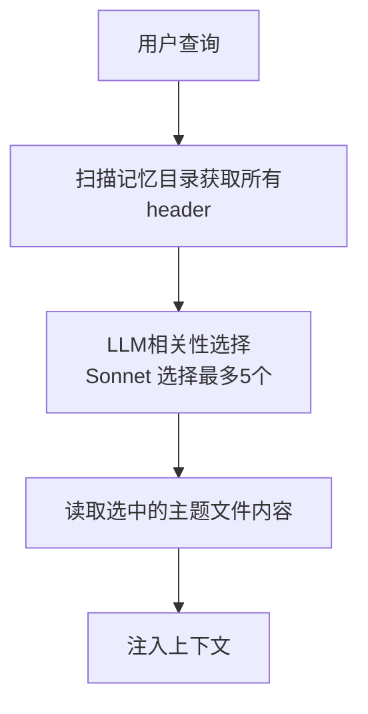
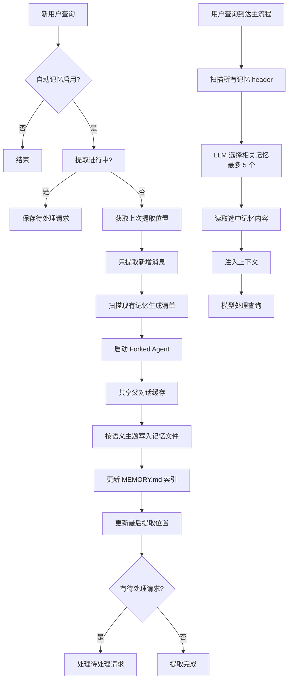
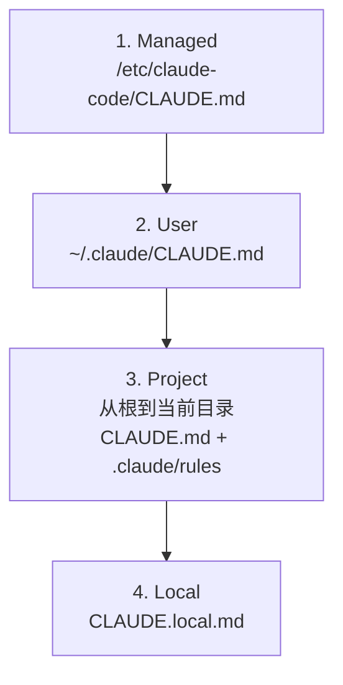
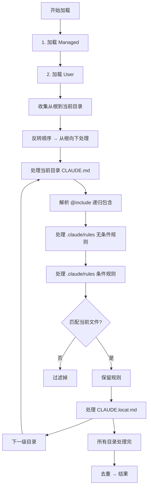
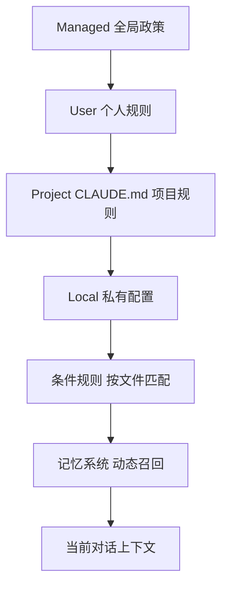
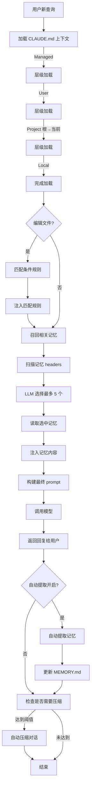

# Claude Code 记忆系统与上下文工程深度分析

## 概述

Claude Code 作为 Anthropic 推出的 AI 编程助手，其核心创新在于将**长期记忆系统**与**分层上下文工程**深度结合，解决了大语言模型在编程场景中的上下文限制问题。本文从技术思想、原理、流程和实现细节四个维度，对 Claude Code 开源恢复版本（v2.1.88）的记忆系统和上下文工程进行深入分析。

### 核心问题

在长周期编程对话中，传统 LLM 面临三大核心问题：

1. **上下文窗口限制**：随着对话增长，token 会溢出上下文窗口
2. **信息遗忘**：早期关键决策和约定会被后续对话挤出去
3. **上下文污染**：不相关的规则和信息干扰模型决策

Claude Code 通过两个核心机制解决这些问题：

- **记忆系统**：自动从对话中提取长期有用信息，存储为文件，并在需要时召回
- **上下文工程**：分层、条件、模块化加载项目规则，保证上下文只包含当前需要的信息

---

## 一、记忆系统

### 1.1 技术思想

Claude Code 记忆系统的核心设计思想是：

> **只存储无法从当前项目状态推导出来的信息**。代码结构、API 用法、git 历史这些都可以通过工具获取，不需要存储。真正需要记忆的是用户偏好、项目背景、经验教训、外部参考这些隐性信息。

这个设计思想体现在 `memoryTypes.ts` 中的 `WHAT_NOT_TO_SAVE_SECTION`：

```
- Code patterns, conventions, architecture, file paths, or project structure — these can be derived by reading the current project state.
- Git history, recent changes, or who-changed-what — `git log` / `git blame` are authoritative.
- Debugging solutions or fix recipes — the fix is in the code; the commit message has the context.
- Anything already documented in CLAUDE.md files.
- Ephemeral task details: in-progress work, temporary state, current conversation context.
```

### 1.2 记忆分类体系

Claude Code 定义了四种记忆类型，每种有不同的作用域和用途：

| 类型 | 作用 | 作用域 |
|------|------|--------|
| `user` | 用户角色、偏好、工作风格 | 全局（所有项目）|
| `feedback` | 用户对工作方式的指导（应该做什么/不应该做什么）| 私有/团队 |
| `project` | 项目背景、当前任务、决策原因 | 当前项目 |
| `reference` | 外部系统指针（bug 追踪、仪表盘等）| 跨项目/当前项目 |

源代码定义：

```typescript
// src/memdir/memoryTypes.ts
export const MEMORY_TYPES = [
  'user',
  'feedback',
  'project',
  'reference',
] as const
export type MemoryType = (typeof MEMORY_TYPES)[number]
```

每种类型都有明确的**何时保存**和**如何使用**指导，这些指导会写入 `MEMORY.md` 索引文件，引导 LLM 正确使用记忆系统。

### 1.3 系统架构

Claude Code 记忆系统采用**索引+主题文件**的二级架构：



**二级架构优势：**

1. **扫描快**：只读取每个文件的 frontmatter（前 30 行），不需要读取整个文件
2. **选择准**：LLM 基于语义理解选择相关记忆，比向量检索更灵活
3. **成本低**：选择只需要 ~100 tokens，大部分成本由 prompt 缓存吸收

### 1.4 记忆扫描实现

`memoryScan.ts` 实现了高效的记忆文件扫描：

```typescript
// src/memdir/memoryScan.ts
const MAX_MEMORY_FILES = 200
const FRONTMATTER_MAX_LINES = 30

export async function scanMemoryFiles(
  memoryDir: string,
  signal: AbortSignal,
): Promise<MemoryHeader[]> {
  try {
    const entries = await readdir(memoryDir, { recursive: true })
    const mdFiles = entries.filter(
      f => f.endsWith('.md') && basename(f) !== 'MEMORY.md',
    )

    const headerResults = await Promise.allSettled(
      mdFiles.map(async (relativePath): Promise<MemoryHeader> => {
        const filePath = join(memoryDir, relativePath)
        const { content, mtimeMs } = await readFileInRange(
          filePath,
          0,
          FRONTMATTER_MAX_LINES,
          undefined,
          signal,
        )
        const { frontmatter } = parseFrontmatter(content)
        return {
          filename: relativePath,
          filePath,
          mtimeMs,
          description: frontmatter.description || null,
          type: parseMemoryType(frontmatter.type),
        }
      }),
    )

    return headerResults
      .filter(
        (r): r is PromiseFulfilledResult<MemoryHeader> =>
          r.status === 'fulfilled',
      )
      .map(r => r.value)
      .sort((a, b) => b.mtimeMs - a.mtimeMs)
      .slice(0, MAX_MEMORY_FILES)
  } catch {
    return []
  }
}
```

**关键优化点：**

| 优化 | 效果 |
|------|------|
| `readFileInRange` 只读前 30 行 | 减少 I/O，扫描速度提升 10x+ |
| 排除 `MEMORY.md` | 索引文件不是主题记忆，避免重复 |
| 按修改时间倒序 | 新修改的记忆更可能相关 |
| 截断到 200 个文件 | 控制 LLM 选择的输入大小 |

### 1.5 相关性检索 - LLM 选择替代向量检索

Claude Code **没有使用向量检索**，而是直接用轻量 LLM（Claude 3.5 Sonnet）选择相关记忆。这是一个非常务实的设计：

```typescript
// src/memdir/findRelevantMemories.ts
export async function findRelevantMemories(
  query: string,
  memoryDir: string,
  signal: AbortSignal,
  recentTools: readonly string[] = [],
  alreadySurfaced: ReadonlySet<string> = new Set(),
): Promise<RelevantMemory[]> {
  const memories = (await scanMemoryFiles(memoryDir, signal)).filter(
    m => !alreadySurfaced.has(m.filePath),
  )
  if (memories.length === 0) return []

  const selectedFilenames = await selectRelevantMemories(
    query, memories, signal, recentTools,
  )
  // ... 转换为结果返回
}
```

核心提示词设计非常精妙：

```
If a list of recently-used tools is provided, do not select memories that are usage 
reference or API documentation for those tools (Claude Code is already exercising them). 
DO still select memories containing warnings, gotchas, or known issues about those tools — 
active use is exactly when those matter.
```

这个规则抓住了关键：
- ✅ **保留**：工具的坑/警告/已知问题（正在用工具时最需要）
- ❌ **过滤**：工具使用说明（已经在用了，说明没用）

**为什么不用向量检索？**

| 对比维度 | LLM 选择 | 向量检索 |
|----------|-----------|----------|
| 基础设施 | 不需要额外依赖 | 需要向量库 + embedding 模型 |
| 语义理解 | Sonnet 本身就能理解 |  embedding 容易丢失语义细节 |
| 成本 | ~100 tokens = $0.0003 | embedding + 查询 = 更贵 |
| 维护 | 零维护 | 需要维护索引更新 |

### 1.6 自动记忆提取 - Forked 子代理设计

自动记忆提取是 Claude Code 最强大的功能，它会在每次对话后自动运行，从对话中提取有用信息写入记忆系统。核心设计要点：

```typescript
// 重叠请求合并 - 避免重复工作
export async function extractMemories(
  messages: Message[],
  cacheSafeParams: CacheSafeParams,
  abortSignal: AbortSignal,
): Promise<void> {
  if (!isAutoMemoryEnabled()) return
  if (extractInProgress.value) {
    // Coalesce overlapping requests: stash the request for a trailing run
    // after the current one completes. We only need one extraction that
    // includes all messages up to the trailing request's cursor.
    pendingRequest = { messages, cacheSafeParams, abortSignal }
    return
  }
  extractInProgress.value = true
  // ...
}
```

**核心设计特点：**

1. **重叠请求合并**：用户快速发送多条消息时，只提取最后一次，避免重复工作
2. **增量提取**：只处理上次提取后新增的消息，不需要每次处理整个对话
3. **严格权限白名单**：提取代理只能读取文件，只能写入记忆目录：

```typescript
function canExtractUseTool(tool: Tool, ctx: ToolUseContext): PermissionStatus {
  switch (tool.name) {
    case ReadCmd.name:
    case GrepCmd.name:
    case GlobCmd.name:
      return { permission: 'granted' }

    case FileWriteCmd.name:
    case FileEditCmd.name: {
      const path = getPathForPermissionCheck(tool)
      if (!path) return { permission: 'denied' }
      // Only allow writing to the memory directory
      if (!path.startsWith(getMemoryDir())) {
        return { permission: 'denied' }
      }
      return { permission: 'granted' }
    }

    default:
      return { permission: 'denied' }
  }
}
```

这是关键安全设计：即使提取出问题，也只能修改记忆文件，不会影响项目代码。

### 1.7 缓存共享 - 50x 成本优化

自动提取使用 `runForkedAgent` 运行子代理，最精妙的设计是**共享父对话的 prompt 缓存**：

```typescript
// src/memdir/forkedAgent.ts
export type CacheSafeParams = {
  /** System prompt - must match parent for cache hits */
  systemPrompt: SystemPrompt
  /** User context - prepended to messages, affects cache */
  userContext: { [k: string]: string }
  /** System context - appended to system prompt, affects cache */
  systemContext: { [k: string]: string }
  /** Tool use context containing tools, model, and other options */
  toolUseContext: ToolUseContext
  /** Parent context messages for prompt cache sharing */
  forkContextMessages: Message[]
}
```

Anthropic API 缓存键 = 所有前缀消息 + system prompt + tools + model + thinking config。`CacheSafeParams` 保证 fork agent 和父代理完全相同这些参数，整个前缀都命中缓存：

| 方式 | token 成本 |
|------|------------|
| 不缓存 | 重新发送整个 50K 前缀 → **50K tokens** |
| 缓存共享 | 只发送新添加的 1K → **1K tokens** |

**节省 50x 成本**，这就是为什么 Claude Code 可以每次对话后自动提取记忆——成本几乎可以忽略。

### 1.8 自动压缩 - 上下文窗口管理

当对话增长接近上下文窗口时，Claude Code 自动触发压缩：

```typescript
// src/compaction/autoCompact.ts
export function getAutoCompactThreshold(model: string): number {
  const effectiveContextWindow = getEffectiveContextWindowSize(model)
  const autocompactThreshold = effectiveContextWindow - AUTOCOMPACT_BUFFER_TOKENS
  return autocompactThreshold
}
```

阈值计算：

```
effectiveContextWindow = contextWindow - reservedTokensForSummary
autoCompactThreshold = effectiveContextWindow - BUFFER_TOKENS

AUTOCOMPACT_BUFFER_TOKENS = 13,000
```

- 预留 20K 给摘要输出
- 预留 13K 缓冲区，避免触发太频繁

**优先策略：**

```typescript
// 1. Try session memory compaction first
const sessionMemoryResult = await trySessionMemoryCompaction(...)
if (sessionMemoryResult) {
  return { wasCompacted: true, compactionResult: sessionMemoryResult }
}
// 2. Fallback: full compaction
const compactionResult = await compactConversation(...)
```

因为会话记忆已经在增量维护，直接用它做摘要，**不需要重新总结整个对话**，更快更省。

**断路器保护：**

```typescript
MAX_CONSECUTIVE_AUTOCOMPACT_FAILURES = 3
```

连续 3 次失败后停止重试，解决了生产环境中某些会话无法压缩重复尝试浪费大量 API 调用的问题。

### 1.9 MicroCompact 微压缩

MicroCompact 是一种轻量压缩，只压缩可压缩的工具输出：

```typescript
// src/compaction/microCompact.ts
const COMPACTABLE_TOOLS = new Set<string>([
  FILE_READ_TOOL_NAME,
  ...SHELL_TOOL_NAMES,
  GREP_TOOL_NAME,
  GLOB_TOOL_NAME,
  WEB_SEARCH_TOOL_NAME,
  WEB_FETCH_TOOL_NAME,
  FILE_EDIT_TOOL_NAME,
  FILE_WRITE_TOOL_NAME,
])
```

当服务器缓存已经过期（间隔时间超过阈值），清除旧的工具结果内容来减少重写时的大小。这是一种增量优化，不需要完整重压缩。

### 1.10 记忆系统流程图



---

## 二、上下文工程

### 2.1 技术思想

Claude Code 上下文工程（CLAUDE.md 系统）的核心设计思想是：

> **只在需要的时候注入需要的规则**。不同目录、不同文件类型需要不同规则，不要把所有规则都塞给模型，那样会造成上下文污染和token浪费。

通过**层级优先级** + **条件匹配** + **模块化包含**，实现精准上下文控制。

### 2.2 层级架构与优先级

CLAUDE.md 系统采用四层层级架构，加载顺序决定优先级：**越后加载优先级越高**，模型会更关注后加载的内容。



| 层级 | 位置 | 优先级 | 用途 |
|------|------|--------|------|
| Managed | `/etc/claude-code/` | 最低 | 公司/部署全局政策 |
| User | `~/.claude/` | ↓ | 用户个人全局规则 |
| Project | 从项目根到当前目录 | ↓ | 项目提交到 git 的规则 |
| Local | 每个目录 `CLAUDE.local.md` | 最高 | 个人私有配置（gitignore） |

**关键设计：从根向下遍历，越靠近当前目录越晚加载**

```typescript
// src/utils/claudemd.ts
let currentDir = originalCwd
while (currentDir !== parse(currentDir).root) {
  dirs.push(currentDir)
  currentDir = dirname(currentDir)
}
// Process from root downward to CWD
// 越靠近当前目录越晚加载，优先级越高
for (const dir of dirs.reverse()) {
  // 处理 CLAUDE.md ...
}
```

这个设计符合直觉：当前目录的规则比根目录更具体，应该覆盖父目录规则。

### 2.3 条件规则 - glob 匹配

CLAUDE.md 系统支持条件规则：只有编辑匹配 glob 模式的文件时，规则才会被注入上下文。

实现代码：

```typescript
// src/utils/claudemd.ts
export async function processConditionedMdRules(
  targetPath: string,
  rulesDir: string,
  type: MemoryType,
  processedPaths: Set<string>,
  includeExternal: boolean,
): Promise<MemoryFileInfo[]> {
  const conditionedRuleMdFiles = await processMdRules({...})
  
  return conditionedRuleMdFiles.filter(file => {
    if (!file.globs || file.globs.length === 0) return false
    
    const baseDir = type === 'Project'
      ? dirname(dirname(rulesDir))
      : getOriginalCwd()
    
    const relativePath = isAbsolute(targetPath)
      ? relative(baseDir, targetPath)
      : targetPath
    
    if (!relativePath || relativePath.startsWith('..')) return false
    
    return ignore().add(file.globs).ignores(relativePath)
  })
}
```

使用方式：在规则文件 frontmatter 中定义 `paths`：

```yaml
---
paths:
  - "**/*.ts"
  - "**/*.tsx"
description: TypeScript 编码规范
---
# TypeScript 规则...
```

使用 `ignore` 库（就是处理 `.gitignore` 那个库）做匹配，用户已经熟悉 glob 语法，不需要学习新语法。

**优势：**
- 规则只在匹配文件时出现，不污染其他文件上下文
- 可以按语言、按模块、按功能组织规则
- token 利用率高，只加载需要的内容

### 2.4 @include 指令 - 模块化重用

CLAUDE.md 支持 `@include` 指令，允许一个文件包含另一个文件，实现模块化重用。

核心实现：

```typescript
// src/utils/claudemd.ts
function extractIncludePathsFromTokens(
  tokens: ReturnType<Lexer['lex']>,
  basePath: string,
): string[] {
  function extractPathsFromText(textContent: string) {
    // 匹配: (?:^|\s)@((?:[^\s\\]|\\ )+)
    // 意思: 开头或空白分隔 @，然后捕获路径，支持空格转义
    const includeRegex = /(?:^|\s)@((?:[^\s\\]|\\ )+)/g
    let match
    while ((match = includeRegex.exec(textContent)) !== null) {
      // 解析路径，处理转义空格，去掉 fragment ...
    }
  }

  function processElements(elements: MarkdownToken[]) {
    for (const element of elements) {
      if (element.type === 'code' || element.type === 'codespan') {
        continue // 🔥 跳过代码块中的 @
      }
      // 只有文本节点处理 @include
      if (element.type === 'text') {
        extractPathsFromText(element.text || '')
      }
      // 递归处理子节点
    }
  }
}
```

**关键设计细节：**

1. **不匹配代码块中的 @** - 使用 marked Lexer 分词，跳过代码块/代码 span，这样代码里的 `@decorator` 不会被误匹配

2. **智能处理 HTML 注释** - HTML 块级注释中的 @ 会被跳过，但注释后的内容会正确提取：
   ```markdown
   <!-- 这是注释 --> @./included.md
   ```
   `@./included.md` 会被正确匹配。

3. **空格转义支持** - `@path\ with\ space` 正确解析为 `path with space`。

4. **最大深度 5 防止循环** - `a.md includes b.md includes a.md` 会在深度 5 停止，不会栈溢出。

5. **顺序正确** - include 的内容注入在包含文件之前，所以包含文件可以引用 include 定义。

6. **安全限制** - 只允许文本文件（白名单扩展名），防止二进制注入。

### 2.5 HTML 注释智能剥离

作者会在 markdown 里写作者笔记，这些不应该给模型看到，但代码块中的 HTML 注释需要保留。Claude Code 的处理非常精细：

```typescript
// src/utils/claudemd.ts
export function stripHtmlComments(content: string): {
  content: string
  stripped: boolean
} {
  if (!content.includes('<!--')) {
    return { content, stripped: false }
  }
  return stripHtmlCommentsFromTokens(new Lexer({ gfm: false }).lex(content))
}

function stripHtmlCommentsFromTokens(tokens: ReturnType<Lexer['lex']>): {
  content: string
  stripped: boolean
} {
  let result = ''
  let stripped = false
  const commentSpan = /<!--[\s\S]*?-->/g

  for (const token of tokens) {
    if (token.type === 'html') {
      const trimmed = token.raw.trimStart()
      if (trimmed.startsWith('<!--') && trimmed.includes('-->')) {
        const residue = token.raw.replace(commentSpan, '')
        stripped = true
        if (residue.trim().length > 0) {
          result += residue
        }
        continue
      }
    }
    result += token.raw
  }
  return { content: result, stripped }
}
```

**设计原则：**

- ✅ 剥离**块级 HTML 注释**（作者笔记）
- ✅ **代码块/内联代码中的 HTML 注释完整保留**（那是代码的一部分）
- ✅ 行内段落中的 HTML 注释保留不变
- ✅ 未闭合注释保留不变，不会吞掉后续内容

这个细节处理非常到位——只有踩过这个坑才能设计成这样。

### 2.6 嵌套目录加载

当用户编辑嵌套目录中的文件时，CLAUDE.md 系统会从根向下到文件所在目录，每一级都加载：

```typescript
// src/utils/claudemd.ts
export async function getMemoryFilesForNestedDirectory(
  dir: string,
  targetPath: string,
  processedPaths: Set<string>,
): Promise<MemoryFileInfo[]> {
  const result: MemoryFileInfo[] = []

  // 加载当前目录 CLAUDE.md
  // 加载当前目录 .claude/CLAUDE.md
  // 加载当前目录 .claude/rules/ 无条件规则
  // 加载当前目录 .claude/rules/ 匹配当前文件的条件规则
  
  return result
}
```

这样保证了：
- 父目录规则已经加载
- 当前目录规则后加载，优先级更高，可以覆盖父目录规则
- 条件规则只有匹配才加载

### 2.7 缓存与去重

多层缓存去重保证性能：

```typescript
// 整个 getMemoryFiles() 用 lodash/memoize 缓存，整个对话只加载一次
export const getMemoryFiles = memoize(
  async (forceIncludeExternal: boolean = false): Promise<MemoryFileInfo[]> => {
    // ... loading ...
  },
)

// processedPaths: Set<string> 防止循环引用和重复加载
// 跟踪已经处理过的文件，同一个文件不会加载两次

// loadedNestedMemoryPaths: Set<string> 跟踪已经注入的嵌套记忆
```

| 层级 | 去重方式 |
|------|----------|
| 整个函数 | memoize 缓存，整个对话只加载一次 |
| 单个文件 | `processedPaths` 防止循环引用和重复加载 |
| 嵌套加载 | `loadedNestedMemoryPaths` 跟踪已经注入的 |

### 2.8 索引大小控制

`MEMORY.md` 入口索引有严格的大小限制：

```typescript
// src/memdir/memdir.ts
export const MAX_ENTRYPOINT_LINES = 200
export const MAX_ENTRYPOINT_BYTES = 25_000

export function truncateEntrypointContent(raw: string): EntrypointTruncation {
  // 先按行截断，再按字节截断
  // 超出时添加警告，提醒用户保持索引精简
}
```

保证索引不会太大，始终能放进上下文。详细内容放在主题文件，索引只放链接和一句话描述。

### 2.9 上下文工程流程图



---

## 三、记忆系统与上下文工程的结合

记忆系统和上下文工程不是两个孤立的系统，它们深度集成，互相配合，共同解决长周期编程对话中的上下文问题。

### 3.1 职责分离

| 系统 | 职责 | 存储位置 | 生命周期 |
|------|------|----------|----------|
| **上下文工程 (CLAUDE.md)** | 静态规则、编码约定、项目规范 | 项目目录，提交到 git | 长期稳定，随代码更新 |
| **记忆系统** | 动态信息、用户偏好、经验教训、项目背景 | 独立记忆目录 | 持续累积，自动更新 |

**分离原则：**
- 可以通过 git 管理的静态信息 → CLAUDE.md
- 无法从代码推导的动态信息 → 记忆系统

这正好对应记忆系统的 "What NOT to save" 规则：**已经 documented in CLAUDE.md 的信息不要保存到记忆**。

### 3.2 分层信息供给

两者结合形成完整的分层信息供给体系：



越往下，信息越具体，优先级越高：

1. **底层是固定政策** - Managed 和 User 提供基础规则
2. **中层是项目静态规则** - CLAUDE.md 提供项目特定约定，条件规则只加载当前需要的
3. **上层是动态记忆** - 根据当前查询召回相关记忆，提供背景信息
4. **最后是当前对话** - 用户最新指令

### 3.3 缓存共享机制

记忆提取和压缩都使用 `forkedAgent` + `CacheSafeParams` 共享主对话缓存，这个设计是两者都能低成本运行的关键：

```typescript
// 自动记忆提取
const result = await runForkedAgent({
  promptMessages: [...],
  cacheSafeParams: cacheSafeParams, // 👈 共享缓存
  ...
})

// 上下文压缩
const compactionResult = await compactConversation(
  messages,
  toolUseContext,
  cacheSafeParams, // 👈 同样共享缓存
  ...
)
```

成本对比：

| 操作 | 不共享缓存 | 共享缓存 | 节省 |
|------|------------|----------|------|
| 自动提取 | 50K tokens | 1K tokens | **50x** |
| 自动压缩 | 50K tokens | 2K tokens | **25x** |

缓存共享让这两个后台操作的成本可以忽略不计，使得系统可以默认开启这些功能，而不是让用户手动触发。

### 3.4 共同的设计原则

记忆系统和上下文工程共享一套设计原则：

| 原则 | 记忆系统 | 上下文工程 |
|------|----------|------------|
| **只加载需要的** | LLM 选择最多 5 个相关记忆 | 条件规则只加载匹配的 |
| **分级优先级** | 按类型加权，项目记忆 > 用户记忆 | 按层级，越近优先级越高 |
| **大小控制** | 索引限制 200 行/25KB | 单个文件限制 40K 字符 |
| **安全隔离** | 提取只能写记忆目录 | include 只允许文本文件 |
| **增量处理** | 只提取新增消息 | 嵌套目录只加载未加载的 |
| **缓存优化** | fork 共享父缓存 | 整个函数 memoize 缓存 |

这种一致性设计使得整个系统非常优雅，各个组件配合默契。

### 3.5 完整工作流程图



---

## 四、总结

### 4.1 核心设计亮点

**记忆系统：**

1. **LLM 选择替代向量检索** - 不需要额外基础设施，成本更低，效果更好
2. **二级架构（索引+主题）** - 扫描快，选择准，存储灵活
3. **重叠请求合并 + 增量提取** - 避免重复工作，保持高效
4. **Fork 缓存共享** - 50x 成本优化，让自动提取可负担
5. **严格权限隔离** - 只能写记忆目录，安全可控
6. **断路器 + 优先策略** - 生产环境健壮性设计

**上下文工程：**

1. **层级就近优先级** - 越靠近当前目录优先级越高，符合直觉
2. **条件 glob 匹配** - 规则只在需要时注入，不污染上下文
3. **@include 模块化** - 精细处理代码块/HTML 注释，避免误匹配
4. **HTML 注释智能剥离** - 保留代码注释，只剥作者笔记
5. **多层缓存去重** - 整个对话只加载一次，性能优异
6. **大小控制** - 索引和单个文件都有大小限制，避免溢出

**两者结合：**

- 职责清晰分离：静态规则 vs 动态记忆
- 分层信息供给：从全局政策到动态记忆
- 共享缓存架构：都从 prompt 缓存受益
- 一致设计原则：都遵循"只加载需要的"

### 4.2 工程启示

Claude Code 的记忆系统和上下文工程给我们的启示：

1. **务实胜过完美**：不用向量检索，用 LLM 直接选择，简单有效
2. **细节决定成败**：@include 跳过代码块、HTML 注释智能剥离，这些细节决定用户体验
3. **成本优化是功能 enable 的关键**：缓存共享把自动提取成本降了 50x，才让默认开启成为可能
4. **安全设计必须内置**：权限隔离从一开始就设计进去，不是事后补丁
5. **生产环境需要健壮性**：断路器、失败重试限制，这些都是实际跑出来的经验

### 4.3 局限性与改进空间

从分析的代码看，当前设计存在一些可以改进的地方：

1. **记忆检索还是需要扫描所有文件** - 当记忆文件达到数千个，扫描时间会变长，可以考虑增量缓存 header
2. **条件规则每次都要匹配** - 可以缓存匹配结果，文件不变不需要重新匹配
3. **没有记忆过期机制** - 旧的不常用记忆会一直存在，可以考虑按访问频率自动归档

但总体而言，Claude Code 的记忆系统和上下文工程是一个非常成熟、设计优雅的生产级系统，很好地解决了长周期编程对话中的上下文管理问题。

---

## 参考资料

- 恢复源代码：`/home/ubuntu/.openclaw/workspace/claude-code-recovered`
- 初步分析：`claude-code-memory-context-key-code-analysis.md`
- 初步分析：`claude-code-context-engineering-key-code-analysis.md`
- 版本：Claude Code 2.1.88
